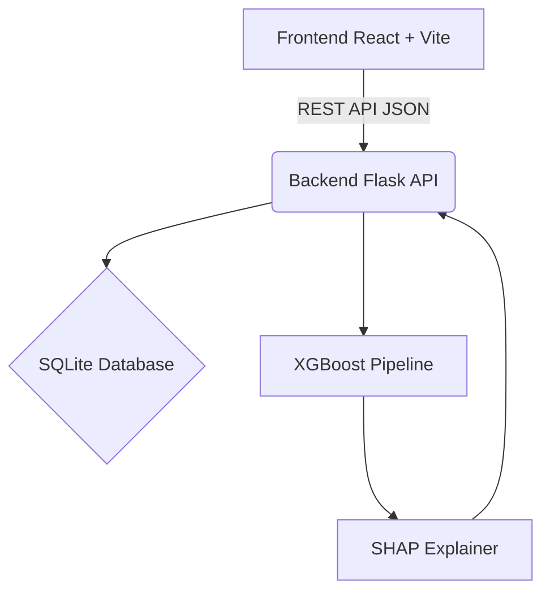

# AI Powered Traffic Accident Analysis and Prediction System

A complete end-to-end Machine Learning, AI, and Web application tailored for analyzing and predicting road accidents in India. The system leverages Explainable AI (SHAP) to help users understand why predictions are made.

## Features
- **Interactive Dashboards:** Visualizations built with Recharts (KPIs, Charts).
- **Accident Hotspots Map:** React-Leaflet based spatial analysis mapped to India.
- **Predictive AI Engine:** XGBoost model predicting accident severity with `99.9%` F1-score.
- **Explainable AI (SHAP):** Clear breakdown of which factors increased or decreased the risk.
- **Role-Based Authentication:** JWT with bcrypt.
- **Prediction History:** Saves prediction records in a SQLite database.

## Architecture



## Folder Structure
```text
Traffic_Accident_Analysis/
├── backend/
│   ├── app.py                 # Main Flask server
│   ├── requirements.txt
│   ├── utils/                 # DB Models, SHAP Helpers
│   ├── routes/                # API Endpoints
│   ├── ml/                    # Data Generation & Training scripts
│   ├── models/                # Saved pipeline and encoders
│   └── data/                  # Indian Accident Dataset (25k rows)
├── frontend/
│   ├── src/
│   │   ├── components/        # Sidebar, Layout
│   │   ├── context/           # JWT Auth context
│   │   ├── pages/             # Dashboard, Predict, Map, Login
│   │   └── services/          # Axios API handler
│   ├── tailwind.config.js
│   └── package.json
└── README.md
```

## Installation & Execution

### 1. Setup Backend
```bash
cd backend
python -m venv venv
.\venv\Scripts\activate
pip install -r requirements.txt
python ml\generate_dataset.py   # Generates 25k records
python ml\train.py              # Trains XGBoost and saves models
python app.py                   # Starts API on http://localhost:5000
```

### 2. Setup Frontend
```bash
cd frontend
npm install
npm run dev                     # Starts React on http://localhost:5173
```

## Future Scope
- Integration with live traffic APIs (Google Maps, Mapbox).
- Dynamic district-level heatmaps using geojson.
- Real-time CCTV analysis for automated reporting.
